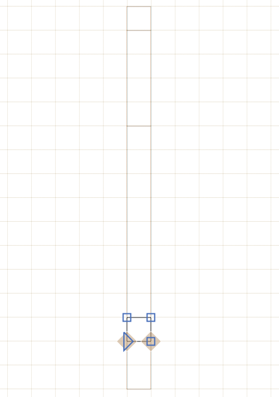

# This is a plugin to load and write Glyph Bitmap Distribution Format file.

### Installation

1. Install the Glyph Note plugin via *Window > Plugin Manager*
2. Restart Glyphs.

If you cannot use the Plugin Manager, follow these steps:

1. Download the complete ZIP file and unpack it, or clone the repository.
2. Double click the file `BDF.glyphsFileFormat`. Confirm the dialogs that appear in Glyphs.
3. Restart Glyphs.

### Usage
The plugin assumes a few things. It uses 10 units per pixes. So if you what to draw a font with 16 px, set the UPM to 160 and ascender to 140 or 130 and descender to -20 or -30. And set the grid to 10.

Then add a glyph called `pixel` and draw a 10 by 10 square at the origin. It should look like this:

